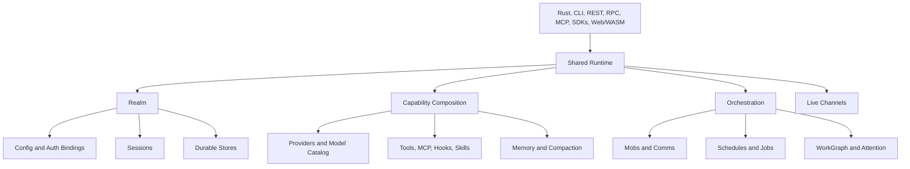

Meerkat is a composable agent runtime. Its CLI, services, SDKs, and browser
runtime are peer surfaces over shared lifecycle and capability contracts.

The central idea is a **realm**: the identity and storage boundary within which
config, credentials, sessions, schedules, WorkGraph commitments, jobs, blobs,
artifacts, and mobs can coordinate.

## Core Read Order

1. [Composability](/concepts/composability) explains why the surfaces share
   contracts instead of implementing separate agent loops.
2. [Realms](/concepts/realms) defines state identity, isolation, storage
   discovery, and backend pinning.
3. [Sessions](/concepts/sessions) covers transcript, lifecycle, history,
   concurrency, persistence, and recovery.
4. [Configuration](/concepts/configuration) covers raw realm documents,
   effective inheritance, runtime overrides, and generation CAS.
5. [Auth and bindings](/concepts/auth-and-bindings) separates model/backend
   choice from credentials and account identity.
6. [Providers](/concepts/providers) explains the model catalog, capability
   gating, provider parameters, and fallback.
7. [Tools](/concepts/tools) explains how an agent acts on the world.

Then add the systems your product needs:

- [Memory and compaction](/concepts/memory-and-compaction)
- [Hooks](/guides/hooks)
- [Skills](/guides/skills)
- [Comms](/concepts/comms)
- [Mobs](/concepts/mobs)
- [Scheduling](/concepts/scheduling)
- [Durable jobs and monitors](/guides/durable-jobs)
- [WorkGraph](/concepts/workgraph)
- [Live channels](/guides/realtime)

## Ownership At A Glance

| Concept | Main question |
|---------|---------------|
| Composability | Which capabilities should this product assemble, and through which surface? |
| Realms | What state is shared, where is it stored, and what stays isolated? |
| Sessions | How does one agent conversation execute, persist, resume, and end? |
| Configuration | Which settings are raw, inherited, or overridden for one request? |
| Auth and bindings | Which backend, account, and credential source serves this model call? |
| Providers | Which model owns an ID, and what can it do? |
| Tools | Which actions are visible and authorized for this session or turn? |
| Memory and compaction | How does useful context outlive one request window? |
| Comms and mobs | How do session-backed agents coordinate as a team? |
| Scheduling and jobs | How does timed or detached work run durably outside an immediate user turn? |
| WorkGraph | How are durable goals, commitments, evidence, and attention tracked? |
| Live channels | How does realtime audio/text transport attach to session identity? |

## Choose A Build Path

| Goal | Start with |
|------|------------|
| Embed Meerkat in Rust | [Rust SDK overview](/rust/overview) |
| Build in Python or TypeScript | [Python SDK](/sdks/python/overview) or [TypeScript SDK](/sdks/typescript/overview) |
| Run a browser/WASM agent | [Web/WASM example](/examples/wasm) |
| Host Meerkat as a service | [JSON-RPC](/api/rpc) or [REST](/api/rest) |
| Build a coordinated team | [Mobs guide](/guides/mobs) |
| Run detached work | [Durable jobs and monitors](/guides/durable-jobs) |
| Run private models | [Self-hosting models](/guides/self-hosting-models) |
| Study ownership and internals | [Architecture](/reference/architecture) |

## See Also

- [Introduction](/introduction)
- [Quickstart](/quickstart)
- [Examples gallery](/examples/gallery)
- [Architecture](/reference/architecture)
